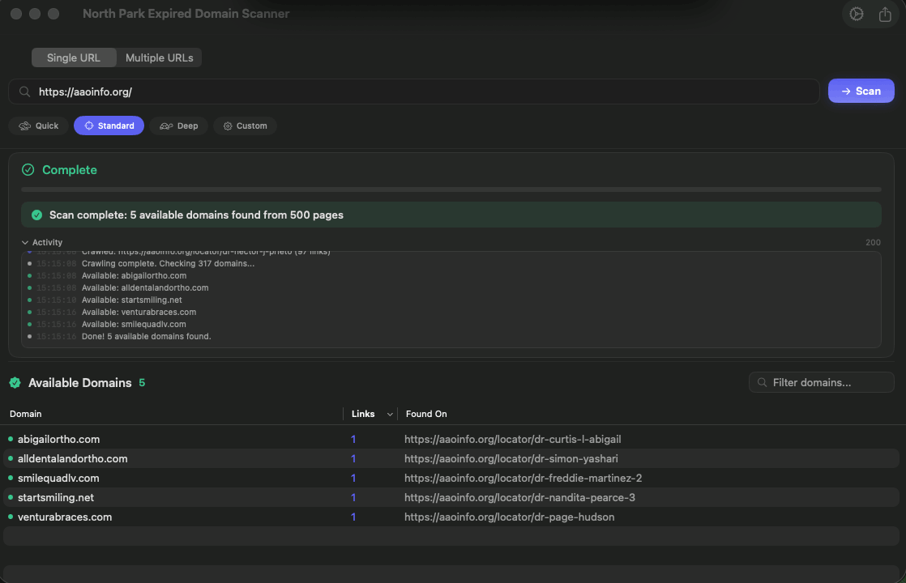

# Expired Domain Finder

**Find high-value expired domains hiding in any website's outbound links.**

A native macOS app that crawls websites, discovers every external domain they link to, and checks which ones are available to register. Built for SEO teams who want to acquire domains with existing backlink equity.



---

## Download

Grab the latest `.app` from [**Releases**](https://github.com/North-Park-Group/expired-domain-finder/releases).

Unzip, drag to Applications, and run. No dependencies, no setup.

> **First launch:** The app is not notarized. Right-click → Open, then confirm. macOS will remember your choice.

### Requirements

- macOS 14 Sonoma or later
- Apple Silicon or Intel

---

## What it does

Enter a URL. The crawler follows every internal link, maps the entire site structure, and extracts every external domain referenced — in anchor tags, script blocks, iframes, data attributes, HTML comments, even JavaScript payloads. Then it checks each one against DNS and WHOIS to surface domains that are expired or available.

The result: a list of domains that real websites still link to, but nobody owns.

---

## Usage

1. **Enter a URL** — paste one or more URLs (comma or newline separated)
2. **Pick a preset** — Quick, Standard, Deep, or Custom
3. **Scan** — the crawler seeds from sitemaps, RSS, and historical archives, then crawls the site
4. **Review results** — available domains are listed with link counts and source pages
5. **Export** — download as CSV for your team

### Tips

- **Forums and blogs** yield the most results — they have years of user-generated outbound links
- **Deep mode** with JS rendering catches links in React/Vue/Angular SPAs
- Use the **Custom** preset to exclude known domains or adjust concurrency for rate-limited sites
- Watch the activity log in real time to understand what the crawler is finding

---

## Features

### Intelligent Crawling
- **Priority queue** ranks content-rich pages (threads, posts, articles) above index pages
- **Pagination detection** follows `rel="next"` / `rel="prev"` links automatically
- **Content deduplication** skips pages with identical body content
- **Configurable depth, page limits, and concurrency**

### Deep Link Discovery
- Standard `<a href>` and `<link href>` extraction
- `data-href`, `data-url`, `data-src`, `data-link` attributes
- Inline URLs inside `<script>` blocks (with JS escape handling)
- `<iframe src>` following
- `<base href>` resolution
- HTML comment scanning
- **WordPress detection** — automatically probes WP REST API, wp-sitemap.xml, categories, and tags when a WordPress site is detected

### Multiple Seeding Strategies
- Sitemap and sitemap index parsing
- RSS / Atom feed discovery
- robots.txt sitemap references
- Wayback Machine historical URLs
- Common Crawl index
- WordPress REST API (posts, pages, categories, tags)

### Optional JavaScript Rendering
Three modes for sites that build their DOM client-side:
- **All Pages** — render every page in a headless browser
- **Fallback** — render only pages where static HTML yielded few links
- **Sample** — render a configurable subset to gauge JS dependency

### Scan Presets
- **Quick** — 100 pages, depth 3. Fast survey.
- **Standard** — 500 pages, depth 10. The default.
- **Deep** — 2,000 pages, depth 20, JS rendering enabled. Thorough.
- **Custom** — full control over every parameter.

### Domain Verification
- DNS resolution check (fast first pass)
- WHOIS lookup with per-TLD rate limiting (accurate second pass)
- Configurable retry logic
- 60+ TLD-specific WHOIS servers

### Export
- CSV export with domain, link count, and source URLs
- Sort by link count to prioritize high-equity domains

---

## Architecture

```
ExpiredDomainFinder/
├── Models/
│   ├── ScanConfiguration.swift    # Presets, JS modes, all config
│   ├── DomainResult.swift         # Result model
│   ├── ScanPhase.swift            # State machine
│   └── ActivityEntry.swift        # Log entries
├── Services/
│   ├── CrawlEngine.swift          # Async crawl orchestrator
│   ├── HTMLParser.swift            # Link extraction (SwiftSoup)
│   ├── PriorityQueue.swift         # Generic min-heap
│   ├── URLNormalizer.swift         # URL canonicalization
│   ├── URLPriority.swift           # Content vs index scoring
│   ├── DomainCheckEngine.swift     # DNS + WHOIS verification
│   ├── DNSResolver.swift           # Async DNS lookup
│   ├── WHOISClient.swift           # NWConnection WHOIS client
│   ├── ContentDeduplicator.swift   # MD5 body fingerprinting
│   ├── DomainExtractor.swift       # Public Suffix List trie
│   ├── JSRenderer.swift            # WKWebView pool
│   ├── WordPressSeeder.swift       # WP REST API discovery
│   ├── SitemapSeeder.swift         # Sitemap/index parser
│   ├── RSSSeeder.swift             # Feed discovery
│   ├── RobotsTxtSeeder.swift       # robots.txt parsing
│   ├── WaybackSeeder.swift         # Wayback Machine CDX API
│   ├── CommonCrawlSeeder.swift     # Common Crawl index
│   ├── NetworkClient.swift         # URLSession wrapper
│   └── CrawlError.swift            # Typed error handling
├── Views/
│   ├── MainView.swift              # Primary UI + settings sheet
│   ├── ScanProgressView.swift      # Real-time progress
│   └── ResultsTableView.swift      # Results table + export
├── Utilities/
│   └── ExcludedDomains.swift       # Known non-registrable domains
└── Tests/
    ├── HTMLParserTests.swift
    ├── URLNormalizerTests.swift
    ├── URLPriorityTests.swift
    ├── PriorityQueueTests.swift
    └── ContentDeduplicatorTests.swift
```

Built with Swift, SwiftUI, and [SwiftSoup](https://github.com/scinfu/SwiftSoup). No Electron. No web views (except optional JS rendering). Native macOS from top to bottom.

---

## Build from source

Requires **Xcode 15+** and **macOS 14+**.

```bash
git clone https://github.com/North-Park-Group/expired-domain-finder.git
cd expired-domain-finder
swift build -c release
```

The binary will be at `.build/release/ExpiredDomainFinder`.

For a universal (Intel + Apple Silicon) build:

```bash
swift build -c release --arch arm64 --arch x86_64
```

---

## License

MIT

---

<p align="center">
  Built by <a href="https://github.com/North-Park-Group">North Park Group</a>
</p>
